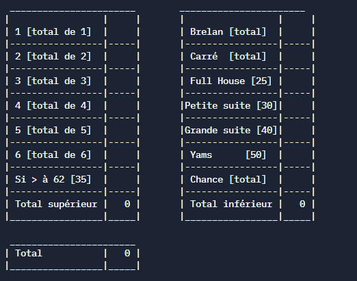
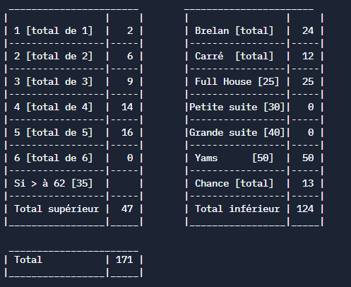
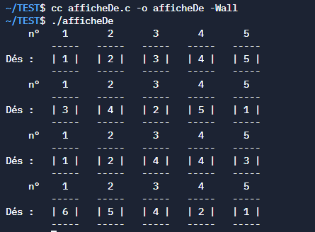
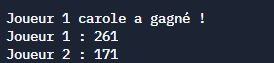
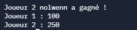
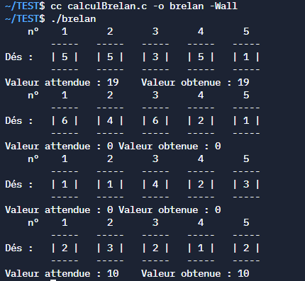
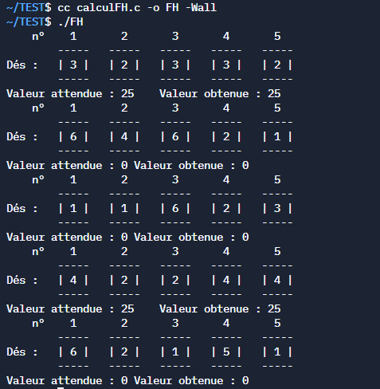
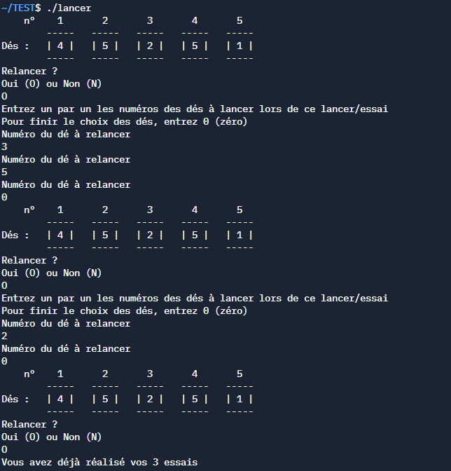

# Projet du jeu du Yams 

Mon travail consistait à réaliser un jeu du Yams en langage C. Ce programme permet de réaliser une partie de 2 joueurs (2 joueurs physiques, pas d'Intelligence Artificielle) du jeu de Yams. Cela se joue en 13 tours pour chaque joueur, il faut lancer des dés puis remplir des combinaisons selon les dés. A la fin du jeu, celui qui a le plus grand score gagne. 

## Les différentes étapes 

- Tout d'abord, la réalisation d'une maquette du projet, sa visualisation et ce qu'il réalise en principal.
- Puis, la réalisation d'un cahier de test pour pouvoir réfléchir aux tests à réaliser après la fin de la conception du jeu du Yams.
- Ensuite, la réalisation en pseudo-code du jeu du Yams et de la liste des fonctions présentes dans le programme du jeu.
- Enfin, la conception du programme du jeu du Yams en langage C.
- Après cela, j'ai réalisé les tests définis lors de la réalisation du cahier de test.

### La maquette

Pour visualiser la maquette, le fichier le contenant est déposé dans ce dépôt sous le nom de **maquette**.

### Cahier de test 

Pour visualiser le cahier de test, le fichier le contenant est déposé dans ce dépôt sous le nom de **Cahier de tests Nolwenn TREUST**.

### Pseudo-Code / Fonctions 

Pour visualiser le pseudo-code et la liste des fonctions, les fichiers les contenant sont déposés dans ce dépôt sous le nom de **algo_principal** et **liste_fonctions_procedure**.

### Code final

Pour visualiser le code final, le fichier le contenant est déposé dans ce dépôt sous le nom de **codeyamsfinal.c**.

## Captures des tests 
Pour finir, j'ai réalisé différents tests pour vérifier que le code du jeu fonctionnait bien. 

### Feuille de marque 
J'ai vérifié l'apparence de la feuille de marque en état initialisé : 

 

Mais aussi une fois remplie : 

 

### Affichage des dés
 

### Affichage gagnant 
 

### Tests de combinaisons 
Brelan : 

 

Full House : 

 

### Lancement des dés 
 
